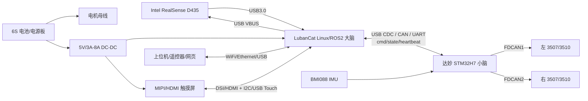

# 达妙桌面轮足 + D435 + LubanCat 改造方案与项目规划

版本：v0.1  
日期：2026-04-28  
对象：基于达妙桌面轮足主体的智能化改造版

## 0. 设计结论

本方案建议采用“达妙实时小脑 + LubanCat 感知大脑”的双控制器架构：

- 达妙 STM32H7/原控制板继续负责 1 kHz 级姿态估计、轮腿 LQR/VMC、CAN 电机控制、失稳保护和急停。
- LubanCat 单板机负责 Linux/ROS2、D435 深度相机、建图/避障/导航、屏幕 UI、日志和远程调试。
- D435 通过 USB3.0 直连 LubanCat；屏幕优先走 MIPI-DSI，备选 HDMI；LubanCat 与 STM32 通过 USB CDC 或独立 CAN/UART 通信。
- 改造的关键不是“把视觉直接接进控制环”，而是先让 LubanCat 只下发低频高层目标，底盘平衡闭环保留在 STM32，等稳定后再逐步加入视觉里程计、局部避障、导航。
- 一期实施应先完成运动系统和 LubanCat 通信链路，详见 `docs/motion_system_lubancat_comm_plan.md`。达妙轮腿使用成品电机内置驱动，STM32 通过 CAN 协议控制电机，不做三相 PWM/FOC 驱动。

推荐项目目标：

1. 第一版实现：手动遥控 + 屏幕状态显示 + D435 可视化 + LubanCat 记录底盘状态。
2. 第二版实现：深度避障 + 速度/转向半自主控制。
3. 第三版实现：RGB-D SLAM/定位 + Nav2 自主导航 + 可视化调参与故障诊断。

## 1. 现有基础

仓库中的达妙桌面轮足资料显示，原始硬件方案为：

- 达妙 STM32H7 开发板。
- 两个达妙 3510 轮毂电机。
- 两个达妙 3507 关节电机。
- 蓝牙模块。
- 控制模型为一阶倒立摆，控制方法为 LQR。

现有固件已经具备这些工程基础：

- FreeRTOS 任务：`INS_Task`、`ChassisR_Task`、默认 USB/VOFA 任务。
- 姿态估计：BMI088 + Mahony/四元数相关算法。
- 电机控制：FDCAN + 达妙 MIT 控制帧，左右两侧分别走 `FDCAN1/FDCAN2`。
- 底盘控制：轮腿状态反馈、腿长估计、LQR 增益随腿长变化、转向控制、跳跃/离地/倒地恢复相关状态。

改造后必须重新评估质量、重心、惯量、电源噪声和散热。D435、LubanCat、屏幕和支架会显著改变上方质量分布，原 LQR 参数不能直接视为最终参数。

## 2. 需求与边界

### 2.1 功能需求

- 保持达妙桌面轮足基础运动能力：站立、前进/后退、转向、腿长调节、停止、失稳保护。
- 新增 D435 深度视觉：彩色图、深度图、点云或深度栅格。
- 新增 LubanCat 单板机：运行 ROS2、RealSense 驱动、状态管理、导航算法、UI 服务。
- 新增屏幕：本机状态面板、模式切换、网络/电池/温度/故障显示、调参入口。
- 支持手动、半自主、自主、调试、急停五类模式。
- 支持日志回放：底盘状态、电机状态、IMU、命令、D435 时间戳。

### 2.2 非功能需求

- 底盘实时控制周期：1 ms 目标，抖动优先控制在 0.2 ms 以内。
- LubanCat 到 STM32 命令频率：50-100 Hz。
- STM32 到 LubanCat 状态频率：100-200 Hz，关键故障事件立即上报。
- 通信失联保护：100 ms 未收到心跳进入限速/保持，300 ms 未收到心跳进入安全停车或失能。
- 电源隔离：电机母线、大脑 5V、屏幕背光、相机 USB 供电要有明确保护和地线拓扑。
- 不允许 LubanCat 直接绕过 STM32 控制电机。

## 3. 总体架构



架构原则：

- 快环留在 STM32：姿态、腿长、速度、LQR/VMC、扭矩限制、失稳保护。
- 慢环放在 LubanCat：目标速度、目标航向、导航路径、避障速度约束、模式管理。
- 感知算法不直接输出扭矩，只输出 `cmd_vel`、限速、停车、目标点或行为状态。
- 屏幕 UI 不参与实时闭环，只读取状态、发送模式命令和调参请求。

## 4. 硬件方案

### 4.1 计算单元

默认按 LubanCat-1-V2/RK3566 设计：

- 优点：体积和功耗适中，具备 USB3.0、MIPI-DSI、千兆网、40Pin、Linux/Android 支持。
- 约束：RK3566 做 D435 + ROS2 + 屏幕 UI + 轻量避障可以接受；完整 RGB-D SLAM、目标识别、多节点 Nav2 会比较吃紧。
- 升级建议：如果目标是稳定跑 SLAM + AI 识别，优先选 LubanCat-4/5 或其他 RK3588 级板卡。

### 4.2 相机

D435 安装建议：

- 位置：机器人前上方，尽量靠近机体中心线，镜头高于轮腿运动干涉区。
- 俯仰角：向下 10-20 度作为初始值，兼顾近距离地面障碍和远端路径。
- 防护：前方加轻量保护框，避免跌倒时相机先触地。
- 减振：相机支架与主体之间加薄减振垫，但不要软到导致视觉外参晃动。
- 线缆：USB3.0 线固定在支架和机体上，避免运动中拉扯接口；线长尽量短。

软件建议：

- 初期深度配置：640x480@30 或 848x480@30，先保证带宽和 CPU 温度稳定。
- 需要点云时再开点云；常规避障优先使用对齐深度图生成局部障碍栅格，减少计算。

### 4.3 屏幕

推荐路线：

1. MIPI-DSI 触摸屏：最适合集成，少占 USB，外观整洁。
2. HDMI 小屏 + USB 触摸：调试最简单，但布线更臃肿，功耗和接口占用更高。
3. 小尺寸 SPI 屏：只做状态屏可行，但交互和图形界面能力不足。

屏幕安装原则：

- 不放在最高点，不把重心继续抬高。
- UI 面向调试者，机器人运动时无需频繁触屏。
- 屏幕背光单独限流/滤波，避免影响 LubanCat 和 D435。

### 4.4 电源

建议电源树：

- 原电机母线：继续给达妙电机供电。
- 5V 大脑电源：6S/电池母线 -> 高效率 DC-DC -> 5V，建议预留 5A 以上，若屏幕较大则预留 8A。
- LubanCat：独立 5V 输入，不从 STM32 板 USB 口反灌。
- D435：从 LubanCat USB3.0 口供电；若实测不稳，使用带外部供电的 USB3.0 Hub。
- 屏幕：按屏幕规格提供 5V 或背光电源，触摸 I2C/USB 单独确认电平。
- 共地：电机电源地与逻辑地单点汇接，CAN/USB 线屏蔽和地线避免形成大电流回路。

保护项：

- 主电源保险/电子保险。
- LubanCat 5V TVS、输入 LC/磁珠、欠压监测。
- D435 USB 口 ESD 和线缆固定。
- 急停硬件切断电机使能或电机母线，不只依赖软件。

### 4.5 机械与重心

改造后必须重新建模：

- 记录新增部件质量：LubanCat、相机、屏幕、支架、线缆、电源模块。
- 在 CAD 中估算新质心高度和前后偏移。
- 支架材料优先 2 mm 碳板/铝板/轻量 3D 打印件，先验证后金属化。
- 相机和屏幕不要共用过软支架；相机外参稳定优先。
- 预留散热风道，LubanCat 上方不要封死。

## 5. 软件架构

### 5.1 STM32 小脑

保留并增强：

- `INS_Task`：BMI088 姿态估计，增加时间戳和状态质量标志。
- `ChassisR_Task`：保持 1 kHz LQR/VMC 控制，新增来自 LubanCat 的速度、航向、腿长、模式目标。
- `CAN BSP`：保留左右电机 CAN 总线，补充错误计数、丢帧统计、温度/电压故障上报。
- `Safety Manager`：急停、跌倒、离地、通信超时、过流/过温/欠压统一状态机。
- `Host Link`：新增二进制协议解析、心跳、CRC、命令仲裁。

建议新增任务：

- `host_link_task`：USB CDC/CAN/UART 收发，100-200 Hz。
- `safety_task`：故障聚合、模式状态机，100 Hz。
- `log_telemetry_task`：可选，低优先级输出调试数据，避免阻塞控制环。

### 5.2 LubanCat 大脑

建议 ROS2 工作区模块：

- `hermes_bringup`：系统启动、参数、launch。
- `hermes_base_bridge`：与 STM32 通信，发布 odom/imu/joint_state/battery/fault，订阅 cmd_vel/mode。
- `hermes_realsense`：D435 驱动参数封装。
- `hermes_perception`：深度障碍物、地面分割、局部 costmap。
- `hermes_nav`：Nav2 配置、速度限制、目标点管理。
- `hermes_ui`：屏幕 UI 后端和前端。
- `hermes_calibration`：相机外参、IMU/轮速、LQR 参数、腿长零点标定工具。

推荐系统：

- Ubuntu 22.04 + ROS2 Humble：资料成熟，生态稳定。
- 若 LubanCat 官方镜像偏 Debian，需要优先验证 ROS2、RealSense SDK 和 USB3 驱动兼容性。
- 使用 systemd 管理开机自启动：`base_bridge`、`realsense`、`ui` 先启动，导航后启动。

### 5.3 通信协议

第一版建议使用自定义二进制帧，原因是简单、可控、适合 STM32：

帧格式：

```text
SOF(0xA5) | version | msg_id | seq | timestamp_us | len | payload | crc16
```

下行命令：

- `CMD_HEARTBEAT`：心跳、主机时间、主机状态。
- `CMD_MODE_SET`：LOCK、IDLE、MANUAL、ASSIST、AUTO、CALIB、ESTOP。
- `CMD_VEL`：线速度、角速度、限速、加速度限制。
- `CMD_BODY`：腿长、站立高度、姿态偏置。
- `CMD_PARAM_SET/GET`：调参。
- `CMD_ESTOP`：紧急停止。

上行状态：

- `STATE_BASE`：模式、故障码、控制周期、通信状态。
- `STATE_IMU`：roll/pitch/yaw、gyro、acc、质量标志。
- `STATE_ODOM`：x、y、yaw、v、w。
- `STATE_MOTOR`：4 个电机位置、速度、扭矩、温度、状态。
- `STATE_POWER`：电池电压、电流、5V、温度。
- `STATE_EVENT`：故障/恢复/参数变化事件。

通信策略：

- 命令 50-100 Hz，状态 100-200 Hz。
- 每帧带 `seq` 和 CRC16。
- STM32 接收命令后只更新目标，不在通信中断里做控制计算。
- 失联、CRC 连续错误、模式冲突进入安全状态。

后续可选：

- 若需要标准 ROS2 接入，可在 LubanCat 侧保持 ROS2，STM32 侧不急于上 micro-ROS。
- 等自定义协议稳定后，再评估 Micro XRCE-DDS/micro-ROS 是否值得引入。

## 6. 感知与导航技术路线

### 6.1 第一阶段：深度避障

输入：

- D435 深度图。
- STM32 上报的底盘速度、姿态、里程。

处理：

- 深度图对齐、裁剪机器人自身区域。
- 地面平面估计或按高度阈值过滤。
- 生成前方扇区障碍距离：左/中/右/近场。
- 输出速度约束：前方近障停车，侧向障碍限转。

优点：计算量小，鲁棒，适合作为第一版闭环能力。

### 6.2 第二阶段：视觉里程计/局部地图

可选路线：

- RGB-D odometry：使用 RGB + Depth 估计短时相对运动。
- 轮速 + IMU EKF：作为底盘 odom 主来源。
- RGB-D 与底盘 odom 融合：通过 `robot_localization` 或自定义 EKF 融合。

注意：D435 没有内置 IMU；如果后续强依赖视觉惯性融合，可考虑 D435i 或外部 IMU 时间同步。

### 6.3 第三阶段：SLAM 与导航

推荐路线：

- 小地图/室内：RTAB-Map RGB-D SLAM 或轻量化方案。
- 导航：Nav2 + local costmap + velocity smoother。
- 控制输出：Nav2 只输出 `cmd_vel`，由 `hermes_base_bridge` 转成 STM32 高层命令。

资源约束：

- RK3566 上先跑低分辨率、低帧率、轻量局部避障。
- RK3588 级板卡再上稳定 RGB-D SLAM、目标识别、复杂 UI。

## 7. 屏幕 UI 技术路线

UI 目标是工程调试和现场运行，不做花哨大屏：

- 首页：模式、急停状态、电池、5V、电机温度、WiFi/IP、相机状态、底盘姿态。
- 控制页：解锁/上锁、手动速度限制、腿长、站立高度、灯光/蜂鸣器。
- 感知页：D435 彩色/深度低帧率预览、障碍距离。
- 调参页：LQR 参数组、速度 PID/滤波、腿长零点、相机外参。
- 日志页：故障历史、通信丢包、CAN 错误、温度曲线。

实现建议：

- 轻量 Qt/QML 或 Web UI 全屏 kiosk。
- UI 与 ROS2 通过 WebSocket/REST/ROS bridge 后端通信。
- UI 命令必须经过 `hermes_base_bridge` 权限和模式检查。

## 8. 控制重整技术路线

### 8.1 动力学与参数重整

新增部件后需要重做：

- 机体总质量 `m`。
- 质心高度 `h`、前后偏移 `x_cg`。
- 俯仰转动惯量 `I_pitch`。
- 轮半径、腿长范围、腿部几何零点。
- 电机扭矩限幅和温升模型。

步骤：

1. CAD 估算新增质量与质心。
2. 静态称重验证左右/前后载荷。
3. 悬挂测试或低速测试识别惯量和响应。
4. 更新 MATLAB/LQR 参数生成脚本。
5. 先低腿长、低速度、限扭矩测试。
6. 逐步恢复速度、腿长、跳跃等高风险动作。

### 8.2 模式状态机

建议统一状态：

- `BOOT`：上电自检。
- `LOCKED`：电机失能，允许通信和校准。
- `IDLE`：电机使能但保持安全姿态。
- `MANUAL`：手动遥控。
- `ASSIST`：深度避障限速。
- `AUTO`：导航控制。
- `CALIB`：标定模式。
- `FAULT`：故障保持。
- `ESTOP`：硬/软急停。

模式切换原则：

- `LOCKED -> IDLE` 必须通过 IMU、CAN、电池、通信检查。
- `IDLE -> MANUAL/AUTO` 必须收到持续心跳。
- 任意状态收到急停立即进入 `ESTOP`。
- `FAULT` 恢复必须显式确认，不自动重新使能电机。

## 9. 项目阶段规划

### 阶段 0：需求冻结与基线记录（2-3 天）

交付物：

- 改造前整机重量、续航、控制周期、CAN 错误率、平衡稳定视频。
- 原始 LQR 参数、腿长范围、轮速换算、故障现象记录。
- 改造目标和验收指标冻结。

验收：

- 原机器人可稳定站立和手动运动。
- 能用 VOFA/串口记录关键状态。

### 阶段 1：机械、电源、布线设计（1 周）

交付物：

- D435 支架、LubanCat 支架、屏幕支架 CAD。
- 电源树和接线图。
- DC-DC、保险、急停、USB3.0 线缆、屏幕线缆选型。

验收：

- 新增部件安装后不干涉轮腿运动。
- LubanCat + D435 + 屏幕满载运行 30 分钟不欠压、不异常重启。

### 阶段 2：STM32 通信与安全改造（1-2 周）

交付物：

- `host_link_task`。
- 二进制协议。
- 心跳超时保护。
- 模式状态机。
- 状态上报和故障码。

验收：

- LubanCat/PC 可发送速度目标，STM32 可回传状态。
- 通信断开 100-300 ms 内进入安全策略。
- 控制周期不因通信任务明显抖动。

### 阶段 3：LubanCat 系统与 ROS2 bringup（1 周）

交付物：

- 系统镜像、网络、SSH、时间同步。
- ROS2 工作区骨架。
- `hermes_base_bridge`。
- systemd 自启动。

验收：

- ROS2 可看到 `/odom`、`/imu`、`/joint_states`、`/battery_state`、`/fault_state`。
- `/cmd_vel` 可控制底盘进入低速运动。

### 阶段 4：D435 驱动与标定（1 周）

交付物：

- RealSense SDK/ROS2 wrapper。
- D435 launch 参数。
- 相机外参 `base_link -> camera_link`。
- 深度图质量测试记录。

验收：

- D435 以目标分辨率连续运行 30 分钟。
- ROS2 发布 color/depth/camera_info。
- TF 树完整，外参误差可接受。

### 阶段 5：屏幕 UI（1 周）

交付物：

- Kiosk UI。
- 状态页、控制页、故障页、调参页。
- UI 权限和模式检查。

验收：

- 开机自动进入 UI。
- 触屏控制不会绕过安全状态机。
- 故障/急停状态醒目可见。

### 阶段 6：深度避障与半自主（1-2 周）

交付物：

- 深度障碍检测节点。
- 速度限制器。
- 避障参数配置。

验收：

- 前方近障可自动减速/停车。
- 手动模式下避障可作为安全限速。
- 不因深度瞬时噪声产生明显抖动。

### 阶段 7：SLAM/Nav2 自主导航（2-4 周）

交付物：

- RGB-D odom/SLAM 配置。
- Nav2 costmap、controller、planner 参数。
- 目标点 UI/远程发送。

验收：

- 小范围室内建图可复现。
- 目标点导航成功率达到项目要求。
- 失去视觉或定位漂移时能安全降级。

### 阶段 8：整机调参、可靠性与文档（1-2 周）

交付物：

- 最终 LQR/VMC 参数组。
- 线束图、装配图、启动流程、标定流程、故障码表。
- 测试报告和演示脚本。

验收：

- 连续运行测试通过。
- 低电压、通信丢失、相机掉线、屏幕卡死、电机过温等故障均有明确表现和恢复路径。

## 10. 里程碑

| 里程碑 | 目标 | 判定标准 |
|---|---|---|
| M0 | 改造前基线 | 原车可控，数据可记录 |
| M1 | 硬件上车 | LubanCat/D435/屏幕稳定供电，不干涉运动 |
| M2 | 大脑小脑打通 | `/cmd_vel` 到 STM32，状态回 ROS2 |
| M3 | 相机可用 | D435 ROS2 数据连续稳定 |
| M4 | UI 可用 | 屏幕可看状态、切模式、查故障 |
| M5 | 半自主避障 | 手动运动时可自动限速/停车 |
| M6 | 自主导航 | 小范围目标点导航闭环 |
| M7 | 可靠性收口 | 故障注入和连续运行通过 |

## 11. 验收指标建议

- 平衡稳定：新增硬件后原地站立 10 分钟不倒。
- 手动控制：0-0.5 m/s 线速度范围内可控，转向无明显发散。
- 通信延迟：LubanCat 到 STM32 控制命令端到端小于 30 ms。
- 状态刷新：屏幕核心状态刷新不低于 5 Hz，ROS2 状态不低于 100 Hz。
- D435 稳定性：目标分辨率下连续运行 30 分钟无断流。
- 电源稳定：大脑 5V 在运动和电机冲击下不低于板卡最低要求。
- 安全：拔掉通信线、拔掉 D435、UI 崩溃、相机遮挡、低电压、CAN 丢帧均能降级。
- 可维护：一次开机流程、一次标定流程、一次故障复位流程均有文档。

## 12. 风险与对策

| 风险 | 影响 | 对策 |
|---|---|---|
| 重心升高导致 LQR 参数失效 | 站立发散、速度环抖动 | 降低安装高度，重新称重建模，限扭矩逐步调参 |
| USB3.0 带宽/供电不足 | D435 断流、系统卡顿 | 短线、固定线缆、降低分辨率，必要时外供电 USB3 Hub |
| RK3566 算力不足 | SLAM/导航卡顿 | 分阶段先做避障，SLAM 降帧，必要时换 RK3588 |
| 电机噪声影响大脑 | LubanCat 重启、相机掉线 | 独立 DC-DC、滤波、单点地、线束分区 |
| 通信任务阻塞控制环 | 平衡不稳 | 通信低优先级、环形缓冲、控制环只读目标快照 |
| UI 误操作 | 非预期运动 | 模式权限、二次确认、速度限幅、急停优先 |
| 相机外参漂移 | 避障/建图偏差 | 刚性支架、减振不过软、周期检查标定 |
| 屏幕支架受撞 | 跌倒损坏 | 屏幕低位安装，外框防护，跌倒接触先保护主体 |

## 13. 技术路线清单

### 机械路线

1. 测量原车空间、运动包络、质心。
2. 设计 LubanCat、D435、屏幕和电源模块安装位。
3. 做轻量支架原型。
4. 上车验证干涉、振动和跌倒保护。
5. 固化 CAD、BOM、装配图。

### 电气路线

1. 绘制电源树和接线图。
2. 选 5V DC-DC、保险、急停、USB3.0 线缆、屏幕线。
3. 分离电机线、USB3.0、屏幕线、逻辑信号线。
4. 做满载供电测试。
5. 做电机冲击下的大脑稳定性测试。

### 固件路线

1. 梳理现有 FreeRTOS 任务和控制周期。
2. 新增通信任务、协议、CRC、心跳。
3. 新增安全状态机和故障码。
4. 新增参数管理和上报。
5. 重新调 LQR/VMC 参数并形成参数组。

### Linux/ROS2 路线

1. 准备 LubanCat 系统和 ROS2 环境。
2. 实现 `hermes_base_bridge`。
3. 接入 D435。
4. 建立 TF、URDF、robot_state_publisher。
5. 接入屏幕 UI。
6. 接入避障、SLAM、Nav2。

### 感知路线

1. D435 单机测试。
2. 标定相机到 `base_link` 外参。
3. 深度图裁剪和地面过滤。
4. 生成局部障碍距离/栅格。
5. 融合 odom/IMU。
6. 进入 SLAM 和导航。

### 测试路线

1. 台架电源测试。
2. 悬挂电机测试。
3. 低扭矩原地站立。
4. 低速手动运动。
5. 通信失联/急停/低电压故障注入。
6. D435 和 UI 长稳测试。
7. 半自主避障测试。
8. 导航闭环测试。

## 14. 推荐仓库结构

```text
Hermes/
  firmware/
    stm32_h7_balance/
      Core/
      User/
      Protocol/
      Safety/
  ros2_ws/
    src/
      hermes_bringup/
      hermes_base_bridge/
      hermes_description/
      hermes_realsense/
      hermes_perception/
      hermes_nav/
      hermes_ui/
      hermes_calibration/
  hardware/
    cad/
    wiring/
    power/
  docs/
    damiao_lubancat_d435_robot_plan.md
    wiring.md
    protocol.md
    calibration.md
    test_report.md
```

## 15. 近期可执行任务

优先做这 10 件事：

1. 称重：原车、新增模块、装配后整车。
2. 确定 LubanCat 具体型号和系统镜像。
3. 确定屏幕型号、接口、功耗、触摸协议。
4. 选 5V DC-DC，台架验证 LubanCat + D435 + 屏幕满载。
5. 设计并打印第一版相机/屏幕/板卡支架。
6. 定义 STM32 与 LubanCat 二进制通信协议。
7. 在 STM32 增加心跳失联保护和状态上报。
8. 在 LubanCat 实现 `hermes_base_bridge`。
9. 接入 D435 并记录 CPU、温度、帧率、断流情况。
10. 改造后重新计算和实测 LQR 参数。

## 16. 外部资料

- Intel RealSense D435 官方规格：`https://www.intel.com/content/www/us/en/products/sku/128255/intel-realsense-depth-camera-d435/specifications.html`
- RealSense ROS2 Wrapper：`https://dev.realsenseai.com/docs/ros2-wrapper/`
- LubanCat-1-V2 官方硬件资源：`https://doc.embedfire.com/linux/rk3588/quick_start/zh/latest/quick_start/lubancat/lubancat1.html`
- LubanCat 模块支持列表：`https://doc.embedfire.com/linux/rk3588/quick_start/zh/latest/quick_start/support_modules_list/support_modules_list.html`
- 达妙 DM-H3510 官方页面：`https://www.damiaokeji.com/index.php?c=show&id=117`
- 达妙电机开发板官方页面：`https://www.mdmbot.com/index.php?c=show&id=96`
