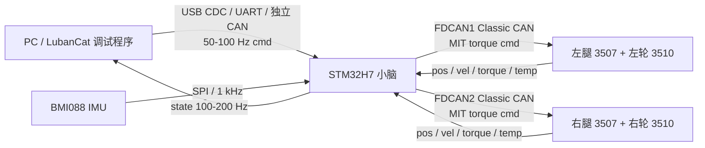

# 运动系统搭建与 LubanCat 通信一期计划

版本：v0.1  
日期：2026-04-28  
目标：先让达妙轮腿机器人可靠动起来，并建立面向后续 ROS2 接入的 LubanCat 通信机制。

## 0. 核心边界

本阶段只解决两件事：

1. STM32 小脑通过 CAN 控制达妙成品电机，使机器人完成安全使能、站立、低速前后、低速转向、停止和失联保护。
2. LubanCat 上位机通过稳定协议向 STM32 下发高层运动命令，并接收底盘状态，为后续 ROS2 的 `/cmd_vel`、`/odom`、`/imu`、`/joint_states`、`/diagnostics` 做准备。

重要约束：

- 达妙轮腿机器人采用成品电机，电机内置驱动器。
- STM32 不做三相 PWM/FOC，不直接驱动 MOS 管，只通过 CAN 协议向电机内置驱动发送控制帧。
- LubanCat 不直接控制电机 CAN 总线。电机 CAN 总线由 STM32 独占，LubanCat 只发送高层目标。
- 机器人平衡和失稳保护必须保留在 STM32 实时闭环内，不能依赖 Linux 上位机实时性。

## 1. 一期系统结构



推荐链路：

- 电机链路：`STM32 FDCAN1/FDCAN2 -> 达妙电机内置驱动`。
- 上位机链路第一选择：`LubanCat USB Host -> STM32 USB CDC Device`。
- 上位机链路备选：`LubanCat UART -> STM32 UART`，或 `LubanCat/USB-CAN -> STM32 独立 CAN3`。
- 不建议第一版让 LubanCat 接入左右电机 CAN 总线，除非只做只读监听，并且物理上不会影响总线实时性。

## 2. 现有电机与 CAN 基线

当前代码中的达妙电机抽象：

- 控制模式：`MIT_MODE = 0x000`、`POS_MODE = 0x100`、`SPEED_MODE = 0x200`。
- 轮毂电机 3510：`mit_ctrl2()`，用于轮端扭矩控制。
- 关节电机 3507：`mit_ctrl3()`，用于腿部关节扭矩控制。
- 反馈内容：电机 ID、状态、位置、速度、转矩、MOS 温度、线圈温度。

当前左右电机规划：

| 位置 | 电机 | CAN | 发送 ID | 反馈 ID | 主要用途 |
|---|---|---:|---:|---:|---|
| 左腿关节 | DM3507 | FDCAN1 | `0x03` | `0x13` | 腿长/支撑力控制 |
| 左轮轮毂 | DM3510 | FDCAN1 | `0x04` | `0x14` | 轮端平衡扭矩 |
| 右腿关节 | DM3507 | FDCAN2 | `0x01` | `0x11` | 腿长/支撑力控制 |
| 右轮轮毂 | DM3510 | FDCAN2 | `0x02` | `0x12` | 轮端平衡扭矩 |

当前控制基线：

- `INS_Task`：BMI088 姿态估计，1 ms 级周期。
- `ChassisR_Task`：轮腿 LQR/VMC 控制，目标周期 `CHASSR_TIME = 1 ms`。
- 轮端速度换算：当前代码使用轮半径 `0.03375 m`。
- 腿长估计：近似按 `2 * l1 * cos(joint_pos)` 计算，`l1 = 0.06507 m`。
- 轮端扭矩限幅：当前示例中轮电机 `[-0.18, 0.18]`。
- 腿关节扭矩限幅：常规 `[-1.0, 1.0]`，跳跃场景 `[-3.0, 3.0]`。

## 3. 运动系统搭建路线

### 3.1 电气和总线检查

目标：确认 CAN、电源、地线、急停在任何运动前可靠。

工作项：

1. 确认电机电源、电机 CANH/CANL、GND、终端电阻、线序。
2. 左右两侧分别形成独立 CAN 总线，避免单侧异常拖垮整车。
3. 确认每个电机的 CAN ID、Master ID、控制模式与代码一致。
4. 确认急停能硬件切断电机供电或使能。
5. 记录电池电压、5V、STM32 供电、电机上电时浪涌。

验收：

- 只接单个电机时能稳定收发 CAN。
- 四个电机同时上电后无总线错误风暴。
- 急停触发后电机立即进入安全状态。

### 3.2 单电机 CAN 台架测试

目标：先证明每个成品电机的 CAN 控制和反馈闭环可用。

测试顺序：

1. 左腿 3507。
2. 左轮 3510。
3. 右腿 3507。
4. 右轮 3510。

每个电机测试项：

- 读取反馈帧，确认 ID、位置、速度、温度合理。
- 发送使能帧，确认电机状态变化。
- MIT 模式零扭矩输出，确认电机无异常动作。
- 小扭矩阶跃，确认方向和反馈符号。
- 失能帧，确认电机退出控制。

验收：

- 每个电机 5 分钟连续 CAN 收发无明显丢帧。
- 位置、速度、扭矩、温度字段可解析。
- 左右方向和符号已记录到表格。

### 3.3 双侧悬空联调

目标：机器人悬空时验证左右腿和左右轮协同，不让机器人带负载站立。

工作项：

1. 架空机器人，轮子离地。
2. 上电后只允许 `LOCKED -> IDLE`，禁止直接进入站立。
3. 执行腿关节小扭矩测试，验证腿长估计方向。
4. 执行轮毂小扭矩测试，验证轮速方向。
5. 通过上位机发送低速命令，确认 STM32 目标变量变化。

验收：

- 四电机均能被统一使能和失能。
- 上位机发 `CMD_VEL` 后，STM32 状态回传中目标速度、目标角速度变化正确。
- 任一电机反馈超时，系统进入 `FAULT` 或 `LOCKED`。

### 3.4 IMU 姿态与电机反馈融合

目标：让站立控制所需状态全部可信。

状态量：

- `pitch`、`pitch_rate`：来自 IMU。
- `roll`、`roll_rate`：来自 IMU。
- `yaw`、`yaw_rate`：来自 IMU 积分/陀螺。
- `wheel_vel_l/r`：来自 3510 反馈。
- `joint_pos_l/r`、`joint_vel_l/r`：来自 3507 反馈。
- `leg_len_l/r`、`leg_len_dot_l/r`：由关节角计算。
- `base_v`、`base_x`：由轮速估计，后续可融合 IMU/视觉。

验收：

- 静止时 IMU 姿态稳定，零偏收敛后 `ins_flag` 置位。
- 手动转动轮/腿，反馈方向和计算值符合实际。
- 机器人未解锁时不会向电机发送非零扭矩。

### 3.5 低风险站立闭环

目标：先让机器人以保守参数站住。

策略：

- 初始腿长固定在安全短腿长，例如 `0.05-0.06 m`。
- 初始速度命令强制为 0。
- 扭矩限幅比原始配置更小，逐步放开。
- 先禁用跳跃、自起、高速转向、自动腿长。
- 上位机只允许 `LOCKED`、`IDLE`、`MANUAL_LOW_SPEED`、`ESTOP`。

站立流程：

1. `BOOT`：上电自检。
2. `LOCKED`：电机未使能，只看状态。
3. `IDLE`：电机使能，零扭矩或轻微保持。
4. `STAND_PREPARE`：腿长目标缓慢到初始值。
5. `STAND`：LQR/VMC 闭环进入站立。
6. `MANUAL_LOW_SPEED`：允许低速 `cmd_vel`。

验收：

- 原地站立 30 秒。
- 轻微扰动能恢复。
- 按急停、拔上位机、关闭 LubanCat 程序都能安全降级。

### 3.6 低速运动闭环

目标：建立“上位机目标速度 -> STM32 闭环 -> 电机扭矩 -> 状态回传”的完整链路。

命令限制：

- 线速度初始范围：`[-0.15, 0.15] m/s`。
- 角速度初始范围：`[-0.5, 0.5] rad/s`。
- 加速度限制：`0.1-0.3 m/s^2` 起步。
- 命令频率：50 Hz 起步。

STM32 内部处理：

- `cmd_vel.linear.x` 映射到 `chassis_move.v_set`。
- `cmd_vel.angular.z` 映射到 `turn_set` 或 `yaw_rate_set`。
- 对速度和角速度做斜坡限幅。
- LQR 输出轮端扭矩，VMC 输出腿关节支撑扭矩。
- 状态回传当前速度、位移、姿态、电机温度、故障码。

验收：

- 上位机低速前进、后退、左转、右转均可控。
- 松开控制或命令超时后机器人减速到 0。
- 运动中状态回传无明显卡顿。

## 4. STM32 固件计划

### 4.1 模块划分

建议新增或重构这些模块：

```text
User/
  APP/
    chassis_task.c        # 1 kHz 运动控制主循环
    safety_task.c         # 100 Hz 安全状态机
    host_link_task.c      # 100-200 Hz 上位机通信
  Protocol/
    hermes_frame.c        # 帧解析、CRC、序号
    hermes_msg.h          # 命令和状态结构体
  Devices/
    DM_Motor/
      dm_motor.c          # 达妙电机 CAN 协议封装
  Safety/
    safety_manager.c
```

最小改造可以先不移动原文件，只新增 `host_link_task` 和 `safety_manager`，把命令目标写入现有 `chassis_move`。

### 4.2 控制周期与优先级

推荐任务优先级：

| 任务 | 周期 | 优先级 | 说明 |
|---|---:|---|---|
| CAN RX ISR | 事件触发 | 中断 | 只收帧、解析到电机状态，不做复杂计算 |
| `INS_Task` | 1 ms | Realtime | IMU 姿态估计 |
| `Chassis_Task` | 1 ms | High | LQR/VMC、电机命令发送 |
| `Safety_Task` | 5-10 ms | AboveNormal | 状态机、故障聚合 |
| `Host_Link_Task` | 5-10 ms | Normal | 上位机收发 |
| `Telemetry_Task` | 20-100 ms | Low | 调试输出 |

规则：

- 控制环不得等待 USB/UART/CAN 上位机收发。
- 上位机命令写入目标快照，控制环只读取最近一次已校验命令。
- 参数更新只能在安全状态或低风险状态执行。

### 4.3 安全状态机

状态：

- `BOOT`：初始化。
- `LOCKED`：电机失能。
- `IDLE`：电机使能但不运动。
- `STAND_PREPARE`：准备站立。
- `STAND`：原地平衡。
- `MANUAL_LOW_SPEED`：低速手动。
- `FAULT`：故障保持。
- `ESTOP`：急停。

关键保护：

- 上位机心跳超时：100 ms 目标速度归零，300 ms 退回 `STAND` 或 `IDLE`。
- 电机反馈超时：进入 `FAULT`。
- pitch/roll 超过阈值：停止轮端扭矩，必要时失能。
- 电机温度过高：限扭，严重时失能。
- CAN 错误过多：进入 `FAULT`。
- 急停输入：立即进入 `ESTOP`。

## 5. LubanCat 通信机制

### 5.1 第一版接口选择

推荐使用 USB CDC：

- STM32 已有 USB/VOFA 基础，改造成二进制协议成本低。
- LubanCat 侧可当作 `/dev/ttyACM*` 串口处理。
- 与左右电机 CAN 总线物理隔离，安全边界清楚。

备选：

- UART：简单稳定，但速率和抗干扰弱于 USB，线缆需要更谨慎。
- 独立 CAN3：工业感更强，但 LubanCat 需要 CAN HAT/USB-CAN，开发成本更高。
- 以太网：STM32 原板未必具备，第一版不建议。

### 5.2 帧格式

```text
SOF       1 byte   0xA5
version   1 byte   0x01
msg_id    1 byte
flags     1 byte
seq       2 bytes
time_ms   4 bytes
len       2 bytes
payload   N bytes
crc16     2 bytes
```

设计原则：

- 小端编码。
- `seq` 用于统计丢包和乱序。
- `time_ms` 便于 LubanCat 与 STM32 对时和日志对齐。
- 所有运动命令都带有效期。
- CRC 错误帧直接丢弃。

### 5.3 下行命令

| msg_id | 名称 | 频率 | 内容 |
|---:|---|---:|---|
| `0x01` | `HEARTBEAT` | 20-50 Hz | 上位机状态、时间戳 |
| `0x02` | `SET_MODE` | 事件 | 目标模式、确认码 |
| `0x03` | `CMD_VEL` | 50-100 Hz | `vx`、`wz`、加速度限制、有效期 |
| `0x04` | `CMD_BODY` | 10-50 Hz | 腿长、roll/pitch/yaw 偏置 |
| `0x05` | `CMD_ESTOP` | 事件 | 急停原因 |
| `0x06` | `PARAM_SET` | 低频 | 参数 ID、值、写入策略 |
| `0x07` | `PARAM_GET` | 低频 | 参数 ID |

`CMD_VEL` 建议 payload：

```text
float vx_mps
float wz_radps
float ax_limit_mps2
float wz_limit_radps2
uint16_t timeout_ms
uint16_t control_flags
```

第一版只启用 `vx_mps` 和 `wz_radps`，其余字段先保留。

### 5.4 上行状态

| msg_id | 名称 | 频率 | 内容 |
|---:|---|---:|---|
| `0x81` | `BASE_STATE` | 100 Hz | 模式、故障码、控制周期、心跳计数 |
| `0x82` | `IMU_STATE` | 100-200 Hz | roll/pitch/yaw、gyro、acc |
| `0x83` | `ODOM_STATE` | 100 Hz | x、y、yaw、vx、wz |
| `0x84` | `MOTOR_STATE` | 50-100 Hz | 4 电机位置、速度、扭矩、温度、状态 |
| `0x85` | `POWER_STATE` | 10-50 Hz | 电池、电源、温度 |
| `0x86` | `EVENT` | 事件 | 故障、恢复、模式切换、参数变更 |

第一版最小状态集：

- `BASE_STATE`
- `IMU_STATE`
- `ODOM_STATE`
- `MOTOR_STATE`

## 6. 面向 ROS2 的映射

LubanCat 先实现一个非 ROS 的串口调试程序，验证通信稳定后再封装为 ROS2 节点。

ROS2 bridge 节点：

```text
hermes_base_bridge
  subscribes:
    /cmd_vel                  geometry_msgs/Twist
    /hermes/mode_cmd          自定义或 std_msgs/String
    /hermes/body_cmd          自定义
  publishes:
    /odom                     nav_msgs/Odometry
    /imu                      sensor_msgs/Imu
    /joint_states             sensor_msgs/JointState
    /diagnostics              diagnostic_msgs/DiagnosticArray
    /hermes/base_state        自定义状态
    /hermes/motor_state       自定义状态
  tf:
    odom -> base_link
```

映射关系：

| ROS2 | STM32 协议 | 说明 |
|---|---|---|
| `/cmd_vel.linear.x` | `CMD_VEL.vx_mps` | 目标前后速度 |
| `/cmd_vel.angular.z` | `CMD_VEL.wz_radps` | 目标转向角速度 |
| `/odom` | `ODOM_STATE` | 第一版由轮速和 IMU 积分得到 |
| `/imu` | `IMU_STATE` | 来自 STM32 BMI088 姿态估计 |
| `/joint_states` | `MOTOR_STATE` | 3507/3510 的位置速度状态 |
| `/diagnostics` | `BASE_STATE/POWER/MOTOR` | 故障和健康状态 |

注意：

- ROS2 的 `/cmd_vel` 不是安全命令。真正执行前必须经过 `hermes_base_bridge` 限幅和 STM32 安全状态机。
- 当 ROS2 节点退出或 `/cmd_vel` 超时，bridge 必须持续发送零速度或显式发送模式降级。
- 第一版不做 Nav2，只让 ROS2 能控制底盘和读状态。

## 7. 分阶段计划

### P0：电机 CAN 基线确认（2-3 天）

交付物：

- 电机 ID 表。
- 单电机 CAN 收发测试记录。
- 方向/符号表。
- 急停和供电检查记录。

验收：

- 四个电机均能单独使能、零扭矩、反馈、失能。
- STM32 能统计 CAN 收发和错误。

### P1：悬空四电机联调（2-3 天）

交付物：

- 四电机统一初始化。
- 左右 CAN 总线稳定性测试。
- 上位机手动命令写入 `chassis_move` 的最小链路。

验收：

- 悬空状态下可通过上位机改变目标速度和转向。
- 实际电机只执行安全限幅后的命令。

### P2：STM32 安全状态机与通信协议（4-6 天）

交付物：

- 二进制协议。
- `host_link_task`。
- `safety_task`。
- 心跳、超时、故障码。

验收：

- 上位机断开、CRC 错误、电机反馈超时均能进入安全状态。
- 控制环周期不被通信影响。

### P3：低风险站立（3-7 天）

交付物：

- 保守 LQR/VMC 参数。
- 站立状态机。
- 站立日志。

验收：

- 原地稳定站立 30 秒，再扩展到 3 分钟。
- 急停和失联测试通过。

### P4：低速运动（3-7 天）

交付物：

- `CMD_VEL` 低速闭环。
- 速度/角速度斜坡限幅。
- 状态回传和日志。

验收：

- 低速前后/转向可控。
- 命令超时自动停车。

### P5：LubanCat ROS2 bridge（1 周）

交付物：

- `hermes_base_bridge` ROS2 节点。
- `/cmd_vel` 控制底盘。
- `/odom`、`/imu`、`/joint_states`、`/diagnostics` 发布。
- launch 和 systemd 启动脚本。

验收：

- `ros2 topic pub /cmd_vel` 可控制低速运动。
- `rviz2` 可看到 TF、odom、IMU 和 joint states。
- 关闭 ROS2 bridge 后机器人安全停车。

## 8. 第一版验收清单

- 四个达妙成品电机均通过 CAN 被 STM32 控制。
- LubanCat 不直接接管电机 CAN 总线。
- STM32 可在无 LubanCat 情况下保持安全上锁。
- LubanCat 可通过 USB CDC 下发 `CMD_VEL`。
- STM32 可回传姿态、里程、电机和故障状态。
- 原地站立、低速前后、低速转向、停止、急停、通信失联均通过。
- ROS2 bridge 能把 `/cmd_vel` 转成 STM32 命令，并发布底盘状态。

## 9. 近期具体任务

1. 整理电机 ID、Master ID、CAN 线序、终端电阻和电源接线。
2. 写单电机 CAN 测试模式，逐个验证 3507/3510。
3. 给现有固件增加 `motor_feedback_timeout` 和 CAN 错误计数。
4. 定义 `hermes_msg.h` 的命令/状态结构体。
5. 在 STM32 USB CDC 上实现帧解析和 CRC。
6. 在 PC 或 LubanCat 写串口调试脚本，先不接 ROS2。
7. 加 `LOCKED/IDLE/STAND/MANUAL_LOW_SPEED/FAULT/ESTOP` 状态机。
8. 悬空验证四电机协同。
9. 地面低扭矩站立测试。
10. 封装 `hermes_base_bridge`，接入 ROS2。

